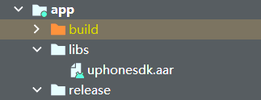

# 1.工程配置
## 配置权限
AndroidManifest.xml清单文件

#### 需要增加以下代码：
```
<uses-permission android:name="android.permission.CHANGE_NETWORK_STATE" />
<uses-permission android:name="android.permission.MODIFY_AUDIO_SETTINGS" />
<uses-permission android:name="android.permission.INTERNET" />
<uses-permission android:name="android.permission.WRITE_EXTERNAL_STORAGE"/>
<uses-permission android:name="android.permission.ACCESS_NETWORK_STATE" />
```
## 导入SDK包
拷贝uphonesdk.aar包到 app模块下的libs，如果没有libs，则手动新建libs文件夹。

 

## 配置参数
配置App 模块下面的build.gradle        
Android 闭包里面增加
```
repositories {
          flatDir {
                   dirs 'libs'
                  }
}
dependencies 闭包中增加
implementation (name: 'uphonesdk', ext: 'aar')
implementation "com.squareup.okhttp3:okhttp:3.11.0"
implementation "com.google.code.gson:gson:2.8.2"
```
## 代码混淆
如果你的接入模块需要代码混淆，请在【接入模块】/proguard-rules.pro 配置文件中加入以下代码:     
>注意：在引入sdk的应用模块下面的proguard-rules.pro文件，这里假定是app模块，即：app/proguard-rules.pro文件中，添加下面混淆规则：
```
#-renamesourcefileattribute SourceFile
-keep class com.ucloud.uphonesdk.*.** { *; }
-keep class com.google.** { *; }
-keep class org.webrtc.** { *; }

```
以上规则只有对应模块的build.gradle 文件，minifyEnabled置为true才生效，如果编译类型是debug，或者其他类型，请按照实际业务需要添加。
```
    buildTypes {
        release {
            minifyEnabled true
            proguardFiles getDefaultProguardFile('proguard-android-optimize.txt'), 'proguard-rules.pro'
        }
    }
    
  ```
# 2.快速入门&接入步骤
为方便 Android 开发者调试和接入云手机产品 API，这里向您介绍适用于 Android 开发的快速接入文档。    
快速入门文档只提供最主要的接入接口，更多详细接口请参考 本文第 3 章节“接口说明”部分。 

| 重要接口            | 接口含义             | 建议调用时机            |
|:-------- |:-------- |:------- |
|registerUphoneListener|注册云手机状态监听器|Activity的onCreate方法|
|initSdk|初始化sdk|Activity的onCreate方法|
|connectUPhone|连接云手机|initSdk 方法成功回调后|
|disconnectUPhone|断开云手机|连接失败后和退出设备连接|

## 注册云手机状态监听器
需要生成设备状态监听器，可以监听连接、设置分辨率、开启关闭直播等的状态信息。
```
iUPhone.registerUphoneListener(mUPhoneListener);
private final IUPhoneListener mUPhoneListener = new IUPhoneListener() {
    @Override
    public void onConnectionFailure(String s) {            
    }
    @Override
    public void onConnectionSuccess() {
    }
    @Override
    public void onControlMsgCallback(String type, int result, String error) {           
    }
};

```
>注:  
      type:setresolution、startlive、stoplive、startgame等操作类型       
      result: 0表示成功，其他表示失败       
      error: 成功时此为空，失败时为具体错误信息

## 初始化云手机sdk
>iUPhone.initSdk(bundle, initCallBackListener);
参数bundle 构造方法如下：
```
Bundle bundle = new Bundle();
bundle.putString("PHONE_ID", "xxx");
bundle.putString("GAME_PACKAGE_NAME", "xxx");
bundle.putString("JOB_ID", "xxx");

```
## 连接云手机
在需要展示画面的布局文件中，比如R.layout.activity_main，插入USurfaceView控件。需要在布局文件中要插入以下代码：
>注意：USurfaceView宽高是wrap content模式，需要保证它的父布局FrameLayout的长宽必须是match parent模式，且只有一个子USurfaceView。
```
<FrameLayout 
xmlns:android=http://schemas.android.com/apk/res/android
xmlns:tools=http://schemas.android.com/tools
android:layout_width="match_parent"
    android:layout_height="match_parent"
    tools:ignore="MergeRootFrame">
<com.ucloud.uphone.USurfaceView
android:id="@+id/usf"
        android:layout_width="wrap_content"
        android:layout_height="wrap_content"
        android:layout_gravity="center"
        android:visibility="visible" 
/>
</FrameLayout>

```
在接入的Activity之中，加入以下代码
```
USurfaceView usv;
IUPhone iUPhone = null;
在对应Activity 的onCreate方法中加入以下代码，并初始化IUPhone实例

```
>注意：下面这句代码一定要在activity 的setContentView之前调用
iUPhone = new UPhone(this); 
>初始化后，就可以在成功的回调函数调用以下方法连接云手机     
iUPhone.connectUPhone(usv);     
参数usv对应于USurfaceView 实例参数

## 断开云手机
在需要断开云手机的地方调用   
iUPhone.disconnectUPhone()

# 3.接口说明
这一部分主要是详细介绍每个接口的功能以及参数说明。

## 初始化sdk
void initSdk(Bundle bundle, OnInitCallBackListener callBack);     
功能描述：初始化sdk，传入相关参数     
参数描述：

| 参数    | 类型   | 意义    |
|:-------- |:-------- |:------- |
|PHONE_ID |String |云手机设备id（必填）|
|GAME_PACKAGE_NAME|String |游戏包名（可选）|
|JOB_ID |String |任务id，可随机生成（可选）|
|callBack|OnInitCallBackListener |初始化方法回调监视器|

## 连接云手机
void connectUPhone(USurfaceView ufView);

功能描述：连接云手机
参数描述：

| 参数            | 类型             | 意义            |
|:-------- |:-------- |:------- |
|  ufView|  USurfaceView |  视图窗口 |

## 断开云手机
void disconnectUPhone();     
功能描述：断开连接云手机

## 重新连接云手机
void reconnection();     
功能描述：重连接云手机

## 设置分辨率
void setResolution(int resolution);     
功能描述：设置云手机分辨率     
参数描述：

| 参数            | 类型             | 意义            |
|:-------- |:-------- |:-------- |
|  resolution  |  int  | 0：480×960P,    //0 标清<br>3：720×1440P,   //3 高清<br>6：1080×2160P,  //6 超清 |

## 发送指定按键
void sendKeyByName(String keyName);      
功能描述：发送指定按键到后台      
参数描述：

| 参数            | 类型             | 意义                                      |
|:------------ |:------------ |:----------------------- |
|  keyName  |  String  |  “home” 返回主桌面<br>“menu” 菜单按键<br>“back”  返回按键 |

## 设置静音
void setAudioMute(boolean mute);
功能描述：设置云手机静音，非本地静音
参数描述：
	
| 参数            | 类型             | 意义            |
|:-------- |:-------- |:-------- |
|  mute  |  boolean  | true 开启静音<br>false 关闭静音 |

## 是否支持直播
boolean isSupportLiving();     
功能描述：返回值代表是否支持直播。

## 开启直播
void startLive(String url);
参数描述： 
	 	
| 参数            | 类型             | 意义            |
|:-------- |:-------- |:-------- |
|  url |  String  | 直播的推流地址，例如rtmp://127.0.0.1:1935/live  |

## 停止直播
Void stopLive();     
功能描述：在开启直播后，可以调用此方法停止直播

## 获取视频流基本参数
VideoBean getQRCodeData();    
功能说明：获取视频分辨率、横竖屏等参数。      
参数说明：返回值：VideoBean      
String height;   //云手机高度      
String width;    //云手机宽度     
boolean bPortrait;//横竖屏标识

## 获得网络延时
Int getNetDelay();      
功能描述：获取网络传输的rtt延时      
返回值：String类型参数，单位：ms

## 获取丢包率
double getLossRate();      
功能描述：获取网络传输过程中的丢包率      
参数说明：返回值是double类型

## 获取网络速度
double getNetworkSpeed();     
功能描述：获取获取网络传输的速度      
参数说明：返回值是两位小数的double类型，单位是MB/s

## 获取用户最后一次操作时间戳
long  getLastOperationTimestamp ();      
功能说明：游戏启动后，通过该接口获取用户最后一次操作实例的时间戳     
参数说明：返回值是long类型的时间戳，单位：ms

## 获得版本号
String getVersionCode();      
功能描述：获得SDK版本号      
返回值： String类型参数


